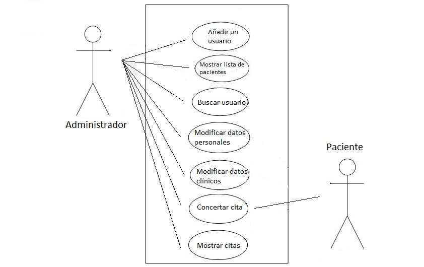

# proyectois
Proyecto Ingeniería del Software

**Partes interesadas:** Centro Clínico.

**Datos que gestiona el sistema:**
Pacientes(+200):
- Nombre.
- Apellidos.
- Teléfono.
- Dirección Postal.
- Fecha de Nacimiento.
- Tipo de paciente (Privado/Público).
- Historial Médico (Enfermedad, Problema, etc..).
- Tratamiento (Dósis, Regularidad).
- Citas Registradas.
- Fecha última modificación.

**Requisitos funcionales:**
- Añadir nuevo usuario.
- Mostrar una lista de los usuarios.
- Buscar usuario por nombre y apellidos.
- Modificar datos personales de paciente.
- Modificar datos clínicos del paciente.

**Requisitos no funcionales:**
- Sistema operativo Linux.
- Interfaz CLI.
- Lenguaje de implementación: C++.
- Máximo 10 GiB de almacenamiento.

Fecha Límite: 23-12.

---

